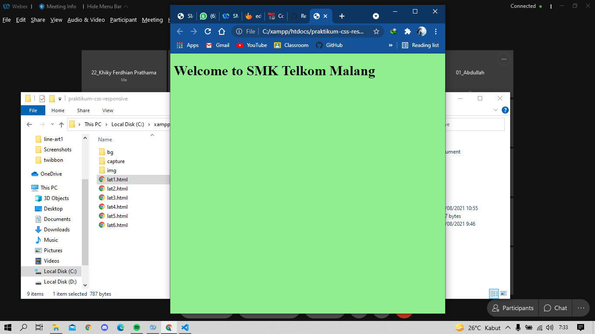
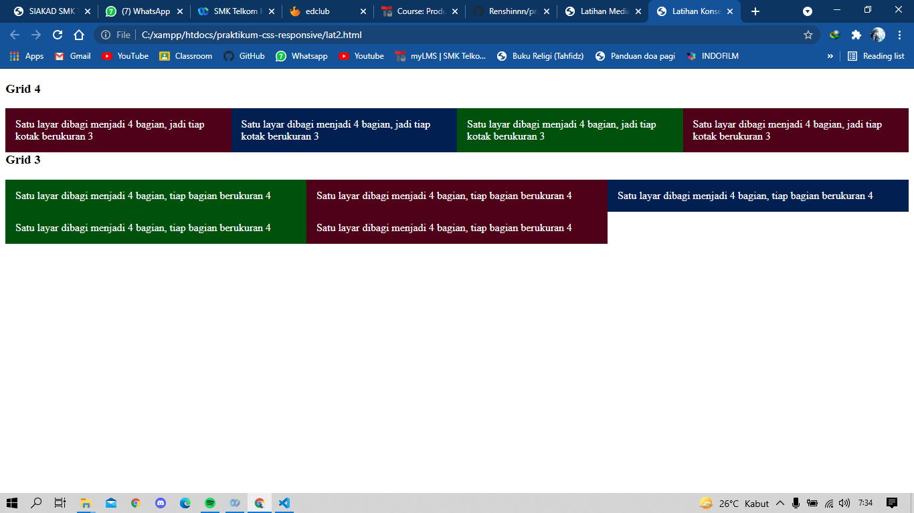
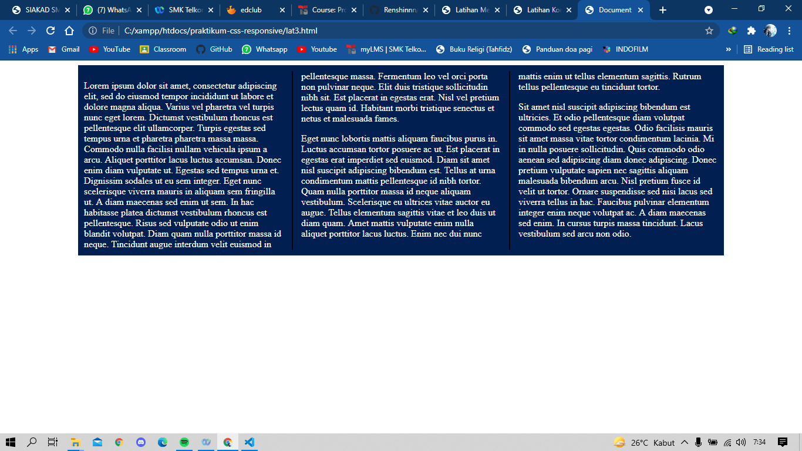
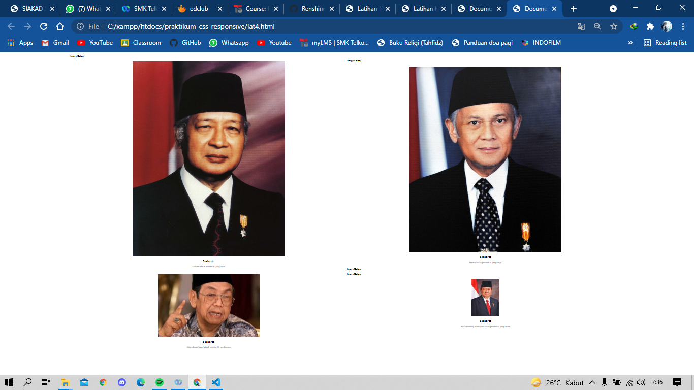
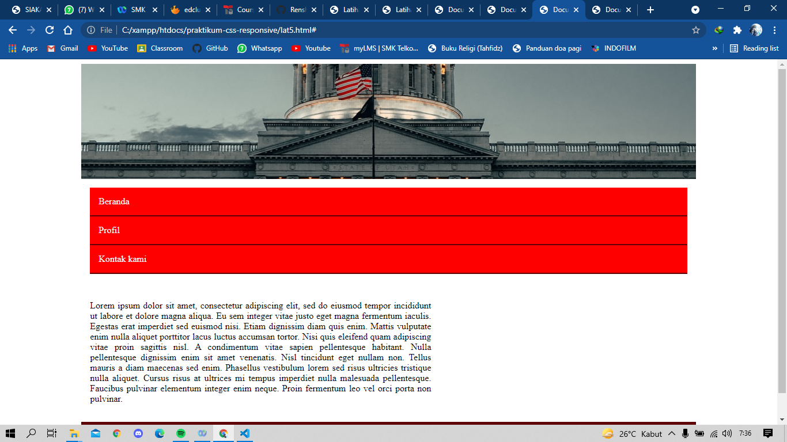
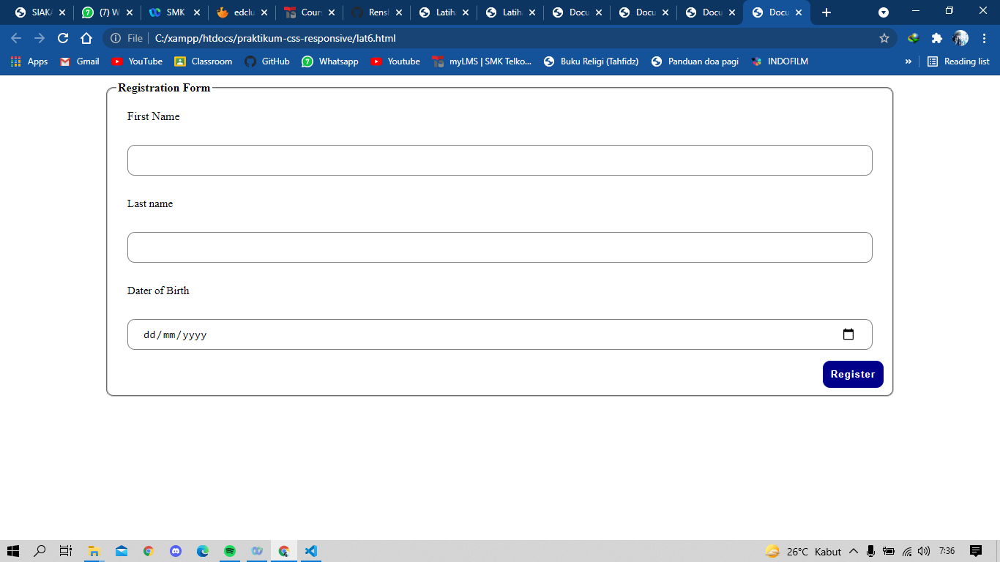

# praktikum-css-responsive
<h2>Pengertian CSS Responsive</h2>

Salah satu prinsip halaman website adalah dapat dijalankan pada browser dari 
berbagai tipe device pengguna. Kategori device pengguna dapat dibedakan menjadi 
kategori perangkat mobile, dektop, dan tablet. Kategori perangkat tersebut berbeda 
dalam ukuran layarnya. Halaman website yang baik harus dapat menyesuaiakan 
ukuran layer dari device pengguna. Untuk mengatasi hal tersebut, dibutuhkan 
sebuah style yang responsive yang biasa disebut dengan CSS Responsive
 
<h2>Latihan Media Query</h2>
 
<h2>Latihan Konsep Grid</h2>
 
<h2>Latihan Responsive Article</h2>
 
<h2>Latihan Responsive Image Gallery</h2>
 
<h2>Latihan Responsive Template</h2>
 
<h2>Latihan Responsive Form</h2>
 
